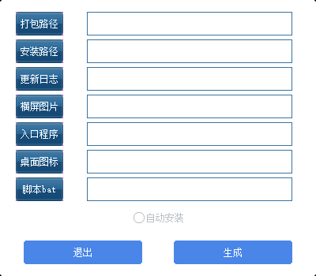
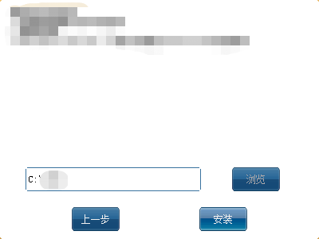
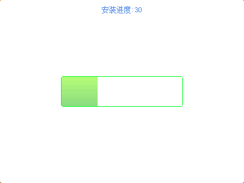

# 一个使用C++，基于duilib界面库实现的开源windows程序打包器

## 主要特点
1. 使用简单，全部操作在一个界面内完成
2. 高度可自定义
3. 占用硬盘空间小，仅有1MB

## 教程

- "打包路径” 选择需要打包的window程序的文件夹路径(包括exe,dll，资源文件等等)。必选

- “安装路径” 选择打包程序在目标计算机上的安装路径。（如不选择安装路径，用户在执行安装的时候可手动选择安装路径，如选择之后，用户将无法更改安装路径）。非必选

- “更新日志” 选择程序的更新日志(txt文件)。（如果选择更新日志之后会在安装时候向用户展示当前的更新信息）非必选

- “横屏图片”选择程序在安装时候的banner(jpg或者 bmp图片)。（如果选择横屏图片之后会在安装时候向用户展示当前的banner）非必选

-  “入口程序”选择程序的入口程序（exe可执行文件）。（用户创建桌面快捷方式，如不选择，无法创建桌面快捷方式）非必选

-  “桌面图片”选择程序的桌面快捷方式图标(ico文件) （创建桌面快捷方式时，如果选择ico文件,此处选择的ico将作为创建桌面快捷方式的图标，否则将提取入口程序的ico作为桌面快捷方式的图标）

-  “脚本bat” 选择程序的脚本文件(bat文件)。（如果选择脚本文件之后，程序安装之后会执行此脚本文件，bat中“%InstallPath%”代表安装程序时选择的安装路径）非必选

- “自动安装” 自动安装勾选之后，生成的程序双击将会自动安装到目标计算机上，无需用户操作鼠标。非必选

## 安装程序效果预览
#### 安装程序首页，如在程序打包界面不选择横屏图片，将显示默认图片

#### 安装程序次页，如在程序打包界面不选择更新信息，更新信息位置将显示“暂无信息”。如在程序打包界面选择安装路径，此处浏览按钮将不可点击，如在程序打包界面未选择安装路径，点击浏览按钮将会弹出路径选择对话框，允许用户选择安装路径。

#### 安装过程界面，用户可以在此界面中查看安装进度，如果安装过程中出现错误，可以在此界面中查看错误信息。

#### 安装完成界面，如在程序打包界面选择入口程序，安装完成界面，将会有桌面图标勾选款，勾选之后点击完成或者启动将在桌面上创建快捷方式。如不选择入口程序，将不会有桌面图标复选框

